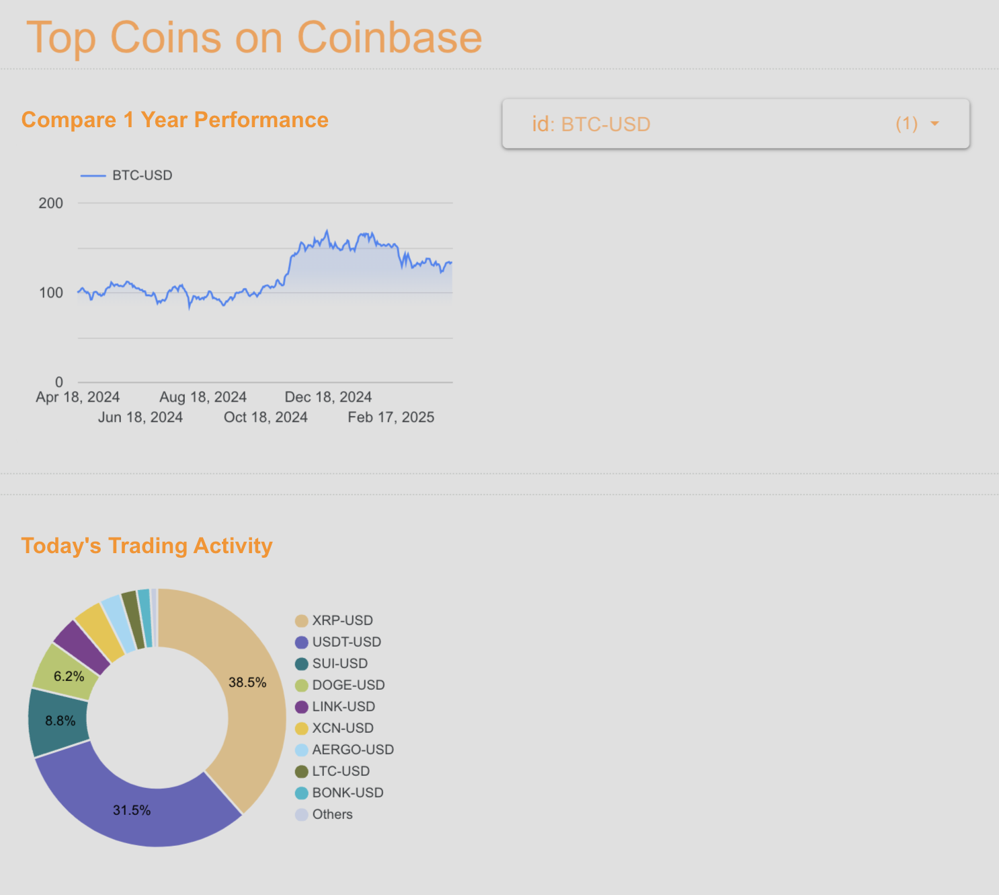

## Problem statement

When investing in cryptocurrencies, making informed decisions requires access to comprehensive, accurate, and timely data. A custom tool that collects cryptocurrency trading data addresses several critical challenges faced by traders.

Comparing returns across multiple cryptocurrencies provides crucial insights that examining a single asset in isolation cannot offer. When you analyze multiple cryptocurrencies side by side, patterns emerge that reveal which assets perform better under specific market conditions. For example, you might discover that while some cryptocurrencies move in tandem with Bitcoin, others follow different patterns, offering hedging opportunities during market downturns.

Additionally, self-hosting provides complete customization freedom. You can tailor the tool to collect exactly the data points that matter to your specific trading approach, integrate with your preferred exchanges, and implement custom indicators or algorithms that align with your investment philosophy.

## Data Pipeline 

We use a batch processing setup, with multiple steps to upload data automatically all run in the cloud to our BigQuery data warehouse.

The entire pipeline runs end to end. Deploy the cloud infrastructure using `terraform apply` in the terraform directory. You will need to define configuration variables that include coinbase API keys, Kafka settings, and GCP project in `terraform/terraform.tfvars`, which is not included in the repository. The output of `terraform apply` will provide the URL needed to access Kafka.

However, the scripts need to be uploaded to each machine:

**Producer**: `gcloud compute ssh coinbase-ingestion-service` to log in, then save (from this repo) `kafka/coinbase_kafka_ingestion.py` to the path `/opt/coinbase-ingestion/coinbase_kafka_ingestion.py` and start the service via `sudo systemctl start coinbase-ingestion`, logs available with command `sudo journalctl -u coinbase-ingestion -f` on the machine. The backfill is disabled by default, edit the script's main function to turn it on.

**Kafka**: Log into Kafka using your configured credentials and given URL. Verify that the producer is publishing messages to Kafka.

**Consumer**: `gcloud compute ssh kafka-bigquery-consumer` to log in, then save (from this repo) `kafka/kafka_bigquery_consumer.py` to the path `/opt/kafka-bigquery-consumer/kafka-bigquery-consumer.py` and start the service via `sudo systemctl start kafka-bigquery-consumer`, logs available with command `sudo journalctl -u kafka-bigquery-consumer -f` on the machine.

### Dataset

Trading data of the top cryptocurrencies on Coinbase is retrieved from the [Coinbase API](https://www.coinbase.com/developer-platform/products/exchange-api). We collect data on all cryptocurrency products, including their trade volume, spot price, current status, intraday candles, and more.

### Producer Script (--> Data Lake)

We use scripts deployed to the cloud via Terraform IaC to collect the data from Coinbase, both backfilled and then a daily batch job, creating messages that are submitted to our Kafka queue (Data Lake)

### Consumer Script (--> Data Warehouse)

We use scripts deployed to the cloud via Terraform IaC to retrieve messages from Kafka, polling periodically and performing basic date/time transformations submitted to our BigQuery data warehouse.

## SQL Transformations

pySpark is used to create three new tables with advanced metrics:

1) Price Indices: for each cryptocurrency, calculate the market price indexed at 100 at the start of the dataset, so that different cryptocurrencies are directly comparable. This is directly visualized in the dashboard.

2) Volatility Metrics: for each cryptocurrency, calculate standard deviation of price over rolling windows (daily, weekly, monthly) to identify the most volatile assets

3) Beta compared to Bitcoin: for each cryptocurrency, calculate how each currency moves relative to Bitcoin (crypto's "market index") over rolling windows (daily, weekly, monthly)

The bash script in `/spark` deploys the python script to the cloud to be run as a serverless Spark job, powered by Google Dataproc. Configure it to match your project settings and run it to execute the job. It's possible to run into permissions issues, you may need to run `gcloud` commands to add permissions to the service account executing the job.

## Dashboard

The dashboard is available to view [here](https://lookerstudio.google.com/reporting/723df5f0-a90a-4a9d-a7f9-0a5f47450f7f). There are two tables shown (for now, subject to be added).

1) Compare 1-year performance - the price indices constructed using historical backfilled data can be viewed. You can select several top cryptocurrencies to see the information collected from Coinbase, BTC selected by default.

2) Today's Trading Activity - the daily job takes the top cryptocurrencies by volume and you can see them compared in a pie chart. The graph is configured to only show the most recent data.
 
Example dashboard: 

## Technologies

* **Cloud**: 100% GCP (Google Cloud Platform)
* **Infrastructure as code (IaC)**: Terraform used for all deployments
* **Data Pipeline**: Multi-step end to end batch processing pipeline (E2E) using Terraform deployed servers, Kafka queue.
* **Data Warehouse**: Data stored on BigQuery
* **SQL Transformations**: Advanced metrics calculated with pySpark deployed on Google Dataproc (executes spark jobs on serverless architecture)
* **Dashboard**: Created using Google Looker Studio, pulling directly from BigQuery